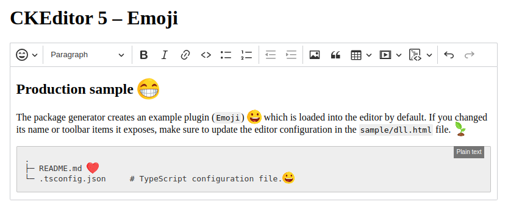

# @linhx/ckeditor5-emoji2

Inserting images as emoji.



## Usage

```shell
npm i @linhx/ckeditor5-emoji2
```

Read [Installing plugins](https://ckeditor.com/docs/ckeditor5/latest/installation/getting-started/installing-plugins.html)

Import css

```javascript
import '@linhx/ckeditor5-emoji2/theme/emoji2.css';
```

Add to toolbar

```javascript
    toolbar: {
        items: [
            ...
            'emoji2',
            ...
        ]
    },
```

Config plugin

```javascript
{
    emoji2: {
        class: string, // your css class of emoji, default is "em"
        defaultGroup: string, // the default group name, for selecting the default group tab when showing the grid
        groups: Map<string, Array<{key: string; name?: string; imgUrl: string}>>, // Map of groups of emojis, e.g. { people: [{ key: 'grinning', name: 'Grinning', imgUrl: '/url' }] }
    }
}
```

### Use my default emojis (the messenger emojis)

1. Import emoji groups:

    ```javascript
    import { emojiGroups } from '@linhx/ckeditor5-emoji2/src/emojisList'

    ```

    ```javascript
    {
        emoji2: {
            defaultGroup: 'p', // people
            groups: emojiGroups
        }
    }
    ```

2. Download `https://github.com/linhx/ckeditor5-emoji2/tree/master/sample/assets/emojis` and copy to your public assets folder, make sure emoji images can be accessed through `yourdomain.com/assets/emojis/<name>.png`

And this is the result [https://linhx.github.io/ckeditor5-emoji2/](https://linhx.github.io/ckeditor5-emoji2/)
